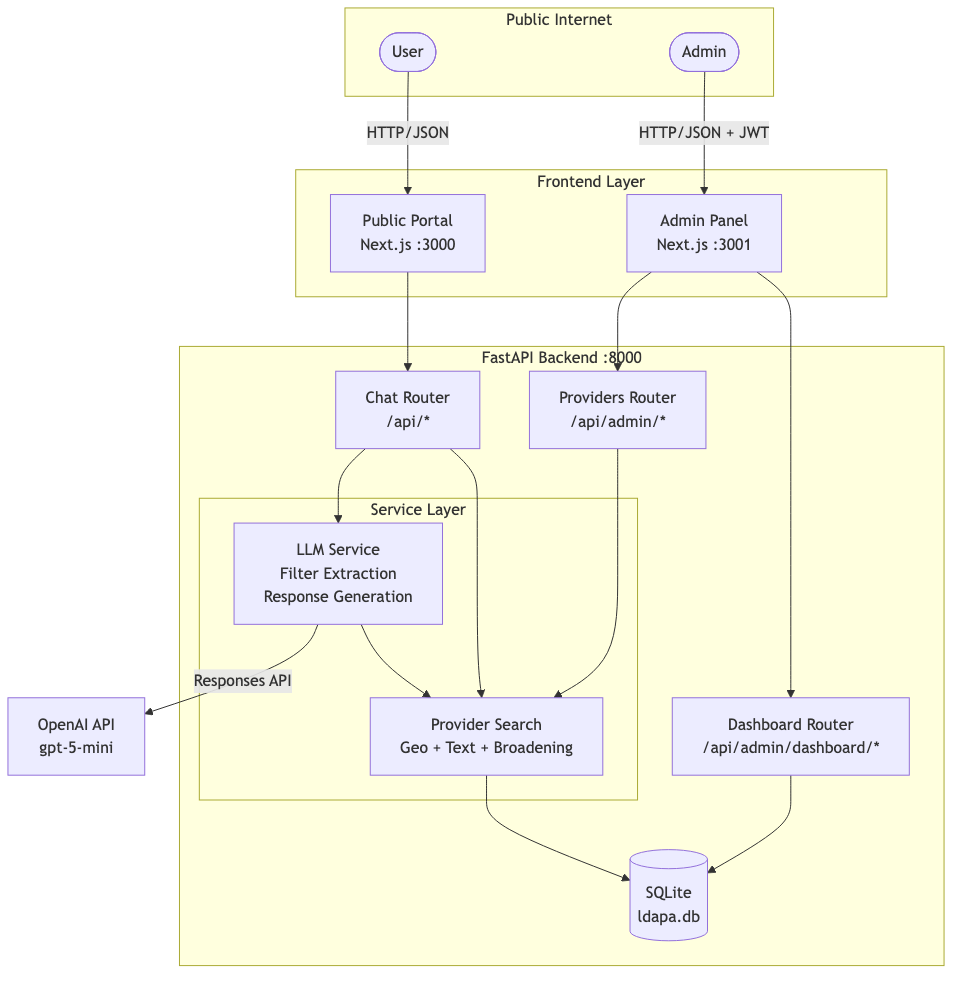
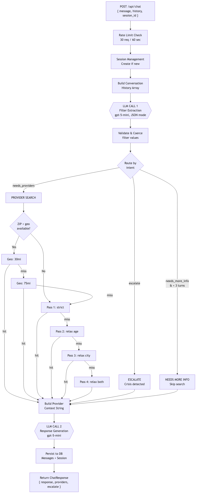
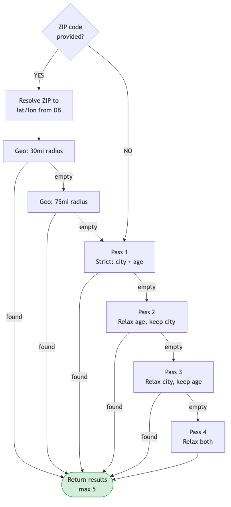
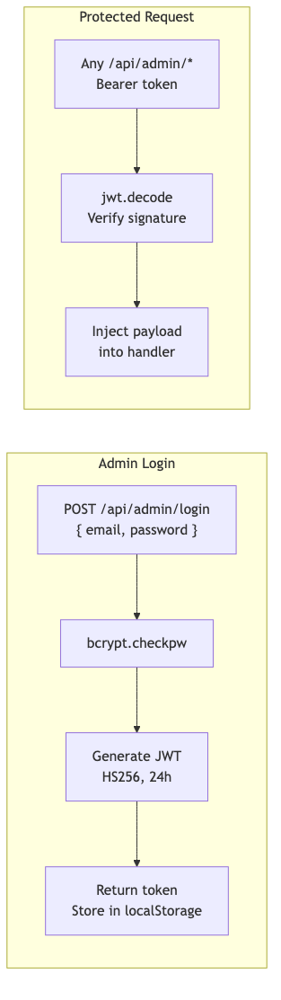
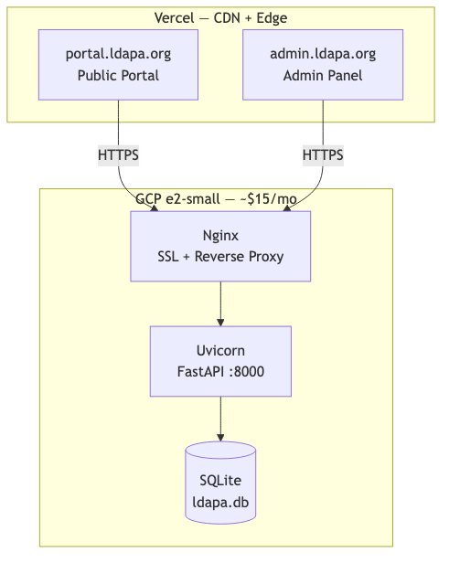
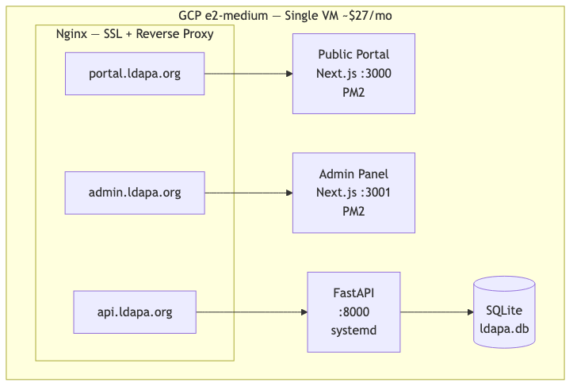

# LDAPA Intelligent Portal — Technical Documentation

## Table of Contents

1. [System Overview](#1-system-overview)
2. [Architecture](#2-architecture)
3. [Tech Stack](#3-tech-stack)
4. [Data Schema](#4-data-schema)
5. [Agentic Flow — Chat Pipeline](#5-agentic-flow--chat-pipeline)
6. [LLM Prompts & Filter Schema](#6-llm-prompts--filter-schema)
7. [Provider Search Engine](#7-provider-search-engine)
8. [Authentication & Authorization](#8-authentication--authorization)
9. [Admin Dashboard](#9-admin-dashboard)
10. [CSV Data Import Pipeline](#10-csv-data-import-pipeline)
11. [API Reference](#11-api-reference)
12. [Environment Configuration](#12-environment-configuration)
13. [Deployment](#13-deployment)
14. [Scaling Considerations](#14-scaling-considerations)

---

## 1. System Overview

The LDAPA Intelligent Portal is a conversational AI system for the Learning Disabilities Association of Pennsylvania. It helps parents, adults, educators, and caregivers find learning disability support providers — tutors, health professionals, lawyers, schools, and advocates — through a natural language chat interface.

**Core capabilities:**
- Natural language chat for provider discovery
- LLM-powered intent extraction and response generation
- Geo-aware provider search with multi-pass broadening
- Admin dashboard for provider management and chat analytics
- Bulk CSV import from the LDAPA directory export

**Current dataset:** 3,610 real providers across Pennsylvania (1,529 tutors, 1,138 health professionals, 792 lawyers, 150 schools, 1 advocate).

---

## 2. Architecture



**Three-application architecture:**

| Component | Framework | Purpose |
|-----------|-----------|---------|
| Public Portal | Next.js 16 | Chat interface for end users |
| Admin Panel | Next.js 16 | Provider management, chat review, analytics |
| Backend API | FastAPI | REST API, LLM orchestration, database |

All frontend-backend communication is via JSON over HTTP. The backend is the single source of truth and the only component that talks to the database and OpenAI.

---

## 3. Tech Stack

### Backend

| Dependency | Version | Purpose |
|-----------|---------|---------|
| Python | 3.10+ | Runtime |
| FastAPI | 0.115.0 | Web framework, async request handling |
| Uvicorn | 0.30.0 | ASGI server |
| aiosqlite | 0.20.0 | Async SQLite driver |
| OpenAI SDK | 2.22.0 | LLM API client (Responses API) |
| Pydantic | 2.9.0 | Request/response validation |
| python-jose | 3.3.0 | JWT token encoding/decoding |
| bcrypt | 4.2.0 | Password hashing |
| python-dotenv | 1.0.1 | Environment variable loading |
| python-multipart | 0.0.9 | File upload parsing |

### Frontend (both apps)

| Dependency | Version | Purpose |
|-----------|---------|---------|
| Next.js | 16.1.6 | React framework with SSR/SSG |
| React | 19.2.3 | UI library |
| Tailwind CSS | 4.x | Utility-first CSS |
| TypeScript | 5.x | Type safety |

### Database

| Technology | Purpose |
|-----------|---------|
| SQLite | Primary database (dev & production for moderate scale) |
| WAL mode | Concurrent read access |

### External Services

| Service | Purpose |
|---------|---------|
| OpenAI API | Filter extraction + response generation (gpt-5-mini) |

---

## 4. Data Schema

### 4.1 Providers Table

The providers table is the core of the system. It stores all LDAPA directory members.

```sql
CREATE TABLE providers (
    -- Identity
    id                TEXT PRIMARY KEY,     -- UUID, generated on import/create
    first_name        TEXT,                 -- From CSV first_name
    last_name         TEXT,                 -- From CSV last_name
    name              TEXT NOT NULL,        -- Computed: "{first_name} {last_name}"
    listing_type      TEXT,                 -- "Individual" or "Company"

    -- Classification
    profession_name   TEXT NOT NULL,        -- Primary category (see below)
    services          TEXT,                 -- Sub-services, e.g. "Therapist,Doctor=>Psychiatrist"
    training          TEXT,                 -- Methodology: "Wilson Language", "Orton-Gillingham"
    credentials       TEXT,                 -- License numbers: "Pennsylvania / SP023530"
    license           TEXT,                 -- License type: "Psychologist"

    -- Location
    address           TEXT,                 -- Raw address from CSV address1
    city              TEXT,                 -- Parsed from address1 (34% fill rate)
    state             TEXT DEFAULT 'PA',    -- Full state name
    state_code        TEXT DEFAULT 'PA',    -- 2-letter code
    zip_code          TEXT,                 -- 5-digit ZIP (90% fill rate)
    lat               REAL,                -- Latitude (88% fill rate)
    lon               REAL,                -- Longitude (88% fill rate)

    -- Ages & Grades
    age_range_served  TEXT,                 -- Free text: "Adults, Teens" or "4-65"
    grades_offered    TEXT,                 -- School-only: "Grades 1-8"

    -- Pricing & Insurance
    price_per_visit   TEXT,                 -- Range: "$150 - $250" (22% fill rate)
    sliding_scale     INTEGER DEFAULT 0,    -- Boolean flag (14% fill rate)
    insurance_accepted TEXT,                -- Free text: "Aetna, Cigna, Highmark" (21% fill rate)

    -- Specialty Flags
    ld_adhd_specialty            INTEGER DEFAULT 0,  -- LD/ADHD specialist flag
    learning_difference_support  INTEGER DEFAULT 0,  -- Supports learning differences
    adhd_support                 INTEGER DEFAULT 0,  -- Supports ADHD

    -- School-Specific (NULL for non-schools)
    student_body_type TEXT,                 -- "Co-Ed", "All-boys", "All-girls"
    total_size        TEXT,                 -- "25 students"
    average_class_size TEXT,
    religion          TEXT,                 -- "Nonsectarian"

    -- Contact
    phone             TEXT,                 -- Phone number (38% fill rate)
    email             TEXT,                 -- Email, filtered for placeholders (89% fill rate)
    website           TEXT,                 -- Website URL (39% fill rate)
    profile_url       TEXT,                 -- LDAPA directory profile link

    -- Admin
    verification_status TEXT NOT NULL DEFAULT 'unverified',  -- verified/unverified/archived
    last_verified_at    TEXT,
    staff_notes         TEXT,
    created_at          TEXT NOT NULL DEFAULT (datetime('now')),
    updated_at          TEXT NOT NULL DEFAULT (datetime('now')),
    is_deleted          INTEGER NOT NULL DEFAULT 0           -- Soft delete flag
);
```

**Indexes:**
- `idx_providers_city` — city text match
- `idx_providers_zip` — ZIP code lookup
- `idx_providers_state` — state filtering
- `idx_providers_status` — verification status
- `idx_providers_profession` — profession type filtering

#### Profession Name Values

| Value | Count | Description |
|-------|-------|-------------|
| `Tutor` | 1,529 | Reading, math, learning support tutors |
| `Health_Professional` | 1,138 | Therapists, psychologists, psychiatrists, counselors |
| `Lawyer` | 792 | Education/disability law attorneys |
| `School` | 150 | Private schools and specialized programs |
| `Advocate` | 1 | Educational advocates |

#### Where Each Field Is Used

| Field | Chat Search | Provider Cards | Admin List | Admin Detail | LLM Context | CSV Import |
|-------|:-----------:|:--------------:|:----------:|:------------:|:------------:|:----------:|
| `name` | relevance ranking | display | display | display | yes | mapped |
| `profession_name` | WHERE filter | badge | type column | display | yes | direct |
| `services` | — | expanded detail | — | display | yes | direct |
| `training` | LIKE filter | expanded detail | — | display | yes | direct |
| `credentials` | — | expanded detail | — | display | yes | direct |
| `city` | WHERE filter | subtitle | location column | display | yes | parsed |
| `state_code` | fallback filter | subtitle | location column | display | yes | direct |
| `zip_code` | geo lookup | subtitle | — | display | yes | direct |
| `lat`/`lon` | proximity search | — | — | — | — | direct |
| `age_range_served` | LIKE filter | expanded detail | — | display | yes | direct |
| `price_per_visit` | — | subtitle | — | display | yes | direct |
| `sliding_scale` | WHERE filter | badge | — | display | yes | parsed |
| `insurance_accepted` | LIKE filter | expanded detail | — | display | yes | direct |
| `ld_adhd_specialty` | WHERE filter | — | — | display | — | parsed |
| `learning_difference_support` | WHERE filter | — | — | display | — | parsed |
| `adhd_support` | WHERE filter | — | — | display | — | parsed |
| `grades_offered` | — | expanded detail | — | display | yes | direct |
| `phone` | — | contact link | — | display | yes | direct |
| `email` | — | contact link | — | display | — | mapped |
| `website` | — | contact link | — | display | yes | direct |
| `verification_status` | WHERE filter | — | status badge | display | — | default |

### 4.2 Chat Sessions Table

Tracks anonymous chat conversations.

```sql
CREATE TABLE chat_sessions (
    id              TEXT PRIMARY KEY,      -- UUID
    user_location   TEXT,                  -- JSON: {"city":"Pittsburgh","zip":"15213"}
    started_at      TEXT NOT NULL,
    last_message_at TEXT NOT NULL,
    message_count   INTEGER NOT NULL DEFAULT 0,
    escalated       INTEGER NOT NULL DEFAULT 0  -- Crisis flag
);
```

**Used by:** Chat router (create/update), Dashboard (stats, recent sessions, session detail).

### 4.3 Chat Messages Table

Stores every message in every conversation.

```sql
CREATE TABLE chat_messages (
    id              TEXT PRIMARY KEY,
    session_id      TEXT NOT NULL REFERENCES chat_sessions(id),
    role            TEXT NOT NULL,          -- "user" or "assistant"
    content         TEXT NOT NULL,
    providers_shown TEXT DEFAULT '[]',      -- JSON array of provider IDs
    created_at      TEXT NOT NULL
);
```

**Used by:** Chat router (store messages), Dashboard (session detail, theme extraction).

### 4.4 Chat Feedback Table

Stores thumbs-up/down feedback on assistant messages.

```sql
CREATE TABLE chat_feedback (
    id          TEXT PRIMARY KEY,
    message_id  TEXT NOT NULL REFERENCES chat_messages(id),
    session_id  TEXT NOT NULL REFERENCES chat_sessions(id),
    rating      TEXT NOT NULL,             -- "up" or "down"  (note: API accepts "positive"/"negative")
    created_at  TEXT NOT NULL
);
```

**Used by:** Chat feedback endpoint, Dashboard (average rating calculation).

### 4.5 Admin Users Table

```sql
CREATE TABLE admin_users (
    id            TEXT PRIMARY KEY,
    email         TEXT NOT NULL UNIQUE,
    password_hash TEXT NOT NULL,           -- bcrypt hash
    name          TEXT NOT NULL,
    created_at    TEXT NOT NULL
);
```

**Default credentials:** `admin@ldapa.org` / `admin123` (change in production).

---

## 5. Agentic Flow — Chat Pipeline

### 5.1 Why Two LLM Calls?

Every user message triggers a pipeline that makes **two separate LLM calls** with a database query in between. This separation exists because the system needs to do two fundamentally different things:

1. **Understand what the user wants** (structured data extraction) — the LLM reads the full conversation and outputs a JSON object describing the user's intent: what type of provider they need, where they are, what age group, whether they mentioned insurance, etc. This is a classification task that benefits from constrained JSON output.

2. **Respond naturally** (free-form text generation) — the LLM takes the conversation history *plus the actual provider results from the database* and writes a helpful, empathetic response. It can only do this after the database query runs, because it needs to know which providers were found (or not found) to craft an appropriate answer.

The database query sits between these two calls — it uses the structured filters from Call 1 to search for matching providers, which are then fed into Call 2 as context.

### 5.2 How a Single Chat Message Is Processed

When a user sends a message, here is exactly what happens:

**Step 1 — Rate limiting and session setup.** The system checks that the user hasn't exceeded 30 requests per minute. If this is the first message, a new session is created with a UUID. The session tracks message count, user location, and whether the conversation has been escalated.

**Step 2 — Build conversation context.** The full conversation history (all prior user and assistant messages) is assembled into an array, with the new message appended. This entire history is passed to both LLM calls so the model has full context — it never sees just the latest message in isolation.

**Step 3 — LLM Call 1: Filter Extraction.** The conversation history is sent to the OpenAI Responses API (gpt-5-mini, reasoning effort: low, JSON output mode) along with the `FILTER_EXTRACTION_PROMPT`. This prompt instructs the model to analyze the conversation and output a structured JSON object containing:
- What type of provider the user wants (`profession_types`)
- Any specializations mentioned (`specializations`)
- Location information (`city`, `zip`)
- Age group of the person needing help
- Whether a specific insurance provider was mentioned
- Whether a specific training methodology was requested (e.g., Orton-Gillingham)
- Three routing flags: `needs_providers`, `needs_more_info`, `escalate`

The raw JSON output is then validated — values are checked against allowed lists, types are coerced, and invalid entries are silently dropped.

**Step 4 — Routing decision.** Based on the extracted filters, the system takes one of three paths:

- **Escalation** (`escalate = true`): The user mentioned crisis, self-harm, abuse, or something that requires human intervention. The session is flagged as escalated, and the response will direct them to LDAPA staff and crisis resources. No provider search happens.

- **Needs more info** (`needs_more_info = true` and fewer than 3 user turns): The user seems to want a provider but hasn't given enough information to search effectively — no location, no service type, no age group. The response will ask 1-2 follow-up questions. No provider search happens. *However*, after 3 user turns, this flag is overridden and a search is forced anyway, to prevent the system from endlessly asking questions.

- **Provider search** (`needs_providers = true`): The user is actively looking for a provider and has given enough information. The system queries the database.

**Step 5 — Provider search (if triggered).** The search engine runs a multi-pass strategy to find up to 5 matching providers. It first attempts geo-based proximity search if a ZIP code was provided and lat/lon data is available. If that yields no results (or no ZIP was given), it falls through to text-based matching with progressive filter relaxation — first strict (exact city + age), then relaxing age, then relaxing city to state-wide, then relaxing both. Lawyers are deprioritized in results unless the user specifically asked for legal help. Full details in Section 7.

**Step 6 — Build provider context string.** The search results (or the reason no search was done) are formatted into a plain text string that will be injected into the response generation prompt. This string tells the LLM exactly what happened:
- `"_ESCALATE_"` — crisis detected
- `"Need more information from the user..."` — not enough info to search
- `"No provider search needed..."` — user asked a general question
- `"No matching providers found..."` — search ran but found nothing
- A formatted list of providers with their details (name, type, training, location, pricing, insurance, phone, website)

**Step 7 — LLM Call 2: Response Generation.** The conversation history is sent again to the OpenAI Responses API, this time with the `RESPONSE_GENERATION_PROMPT` and the provider context string interpolated into it. This prompt defines the assistant's persona (friendly LDAPA guide), its boundaries (never diagnose, never provide legal advice), and five response patterns based on the context type. The model generates a natural language response. If providers were found, the response includes a `[PROVIDERS]` marker that the frontend strips out and replaces with rendered provider cards.

**Step 8 — Persist and respond.** Both the user message and the assistant response are saved to the `chat_messages` table with the session ID. The provider IDs shown are stored as a JSON array. The session's message count and last-activity timestamp are updated. If location was extracted, it's saved to the session. Finally, the `ChatResponse` is returned containing the response text, an array of provider card objects (for frontend rendering), and the escalation flag.

### 5.3 Flow Diagram



### 5.4 Fallback Mode (No OpenAI Key)

When `OPENAI_API_KEY` is not set, the system uses keyword-based fallbacks so the application remains functional without LLM access:

- **Filter extraction:** Regex and keyword matching against hardcoded lists of profession types, specializations, PA city names, ZIP patterns, insurance provider names, and training methodologies. Less accurate than the LLM but covers common cases.
- **Response generation:** Template-based responses with four paths: escalation (directs to crisis lines), providers found (generic intro + `[PROVIDERS]` marker), no providers (suggests contacting LDAPA directly), and general question (asks follow-up questions).

### 5.5 Auto-Search After 3 Turns

After 3 or more user messages, the system overrides `needs_more_info` and forces a provider search with whatever filters have been gathered so far. This prevents the system from endlessly asking clarifying questions when the user may not know exactly what they need — it's better to show imperfect results than to keep asking.

---

## 6. LLM Prompts & Filter Schema

### 6.1 Filter Extraction Prompt

Sent as the system/developer message in LLM Call 1. Instructs the model to return structured JSON.

**Output schema:**

```json
{
  "profession_types": [],
  "specializations": [],
  "insurance": null,
  "training_methodology": null,
  "sliding_scale": false,
  "location": {
    "city": null,
    "zip": null
  },
  "age_group": [],
  "needs_providers": false,
  "needs_more_info": false,
  "escalate": false,
  "search_text": ""
}
```

**Allowed values:**

| Field | Values |
|-------|--------|
| `profession_types` | `tutor`, `health_professional`, `lawyer`, `school`, `advocate` |
| `specializations` | `dyslexia`, `adhd`, `ld`, `learning_differences` |
| `insurance` | Any insurer name (free text) |
| `training_methodology` | Any methodology name (free text) |
| `age_group` | `children` (<13), `adolescents` (13-17), `adults` (18+) |

**Key prompt rules:**
- Extract from entire conversation history, not just last message
- Map user language to profession types (e.g., "therapist" -> `health_professional`)
- `needs_providers=true` only for active provider-seeking intent
- `needs_more_info=true` only when no useful filters can be extracted at all
- `escalate=true` for crisis, self-harm, abuse
- Never re-ask for information already provided

### 6.2 Response Generation Prompt

Sent as the system/developer message in LLM Call 2. Includes the provider context string interpolated into `{provider_context}`.

**Five response modes based on context:**

1. **General Question** — Answer directly, no provider search
2. **Missing Information** — Ask 1-2 follow-up questions conversationally
3. **Providers Found** — Present results with `[PROVIDERS]` marker for card rendering
4. **No Providers Found** — Honest about limitation, suggest LDAPA contact
5. **Escalation** — Empathetic redirect to crisis services (988, 911)

**Boundaries enforced in prompt:**
- Never diagnose, provide legal/medical advice
- Never suggest searching external sites
- Never claim to be a licensed professional
- Always include disclaimer on first response

### 6.3 Filter Validation

After LLM output is parsed as JSON, `_validate_filters()` coerces values:
- Arrays are filtered against allowed value sets
- Strings are trimmed and limited to 200 chars
- Booleans are cast with `bool()`
- Location is validated as a dict with `city`/`zip` keys

---

## 7. Provider Search Engine

### 7.1 Search Strategy

The search engine uses a **tiered fallback** approach to maximize result relevance while ensuring users always get results.



### 7.2 Geo Search

Uses approximate planar distance (valid for PA-scale distances):

- `MILES_PER_DEG_LAT = 69.0`
- `MILES_PER_DEG_LON = 53.0` (cos(40°) × 69)
- Bounding box pre-filter for performance
- Squared distance for ranking (avoids sqrt)

ZIP-to-coordinates resolution uses `AVG(lat), AVG(lon)` from existing providers with that ZIP.

### 7.3 Lawyer Deprioritization

Unless the user explicitly asks for legal help (detected by `profession_types` containing `lawyer`), lawyers are sorted after other provider types using:

```sql
ORDER BY CASE WHEN p.profession_name = 'Lawyer' THEN 1 ELSE 0 END, ...
```

### 7.4 Filter Mapping to SQL

| Filter | SQL Condition |
|--------|--------------|
| `profession_types` | `LOWER(profession_name) IN (?)` |
| `specializations: adhd` | `adhd_support = 1 OR ld_adhd_specialty = 1` |
| `specializations: dyslexia/ld` | `learning_difference_support = 1 OR ld_adhd_specialty = 1` + `LIKE` on training |
| `training_methodology` | `LOWER(training) LIKE ?` |
| `insurance` | `LOWER(insurance_accepted) LIKE ?` |
| `sliding_scale` | `sliding_scale = 1` |
| `age_group: children` | `LOWER(age_range_served) LIKE '%child%' OR '%preteens%' OR '%k-%'` |
| `age_group: adolescents` | `LOWER(age_range_served) LIKE '%teen%' OR '%adolesc%'` |
| `age_group: adults` | `LOWER(age_range_served) LIKE '%adult%' OR '%elder%'` |
| `location.city` | `LOWER(city) = LOWER(?)` |
| `location.zip` | `zip_code = ?` (or geo search if lat/lon available) |

---

## 8. Authentication & Authorization

### Public Routes (no auth)

- `POST /api/chat` — Chat endpoint (rate-limited: 30/60s)
- `POST /api/feedback` — Feedback submission
- `GET /api/health` — Health check

### Admin Routes (JWT required)

All `/api/admin/*` routes require a `Bearer` token in the `Authorization` header.

**Auth flow:**



**Client-side (Admin Panel):**
- Token stored in `localStorage` as `ldapa_admin_token`
- User object stored as `ldapa_admin_user`
- `authFetch()` wrapper auto-attaches Bearer token
- 401 responses redirect to `/login`

---

## 9. Admin Dashboard

### Dashboard Page (`/dashboard`)

Displays four stat cards and two panels:
- **Total Providers** (with verified count)
- **Unverified** count
- **Chat Sessions** (filtered by period: week/month/all)
- **Average Feedback** (0-5 scale, computed from up/down ratio)
- **Chat Volume** — Bar chart of sessions per day
- **Top Query Themes** — Keyword-extracted from recent user messages

### Providers Management (`/dashboard/providers`)

- Table with name, type, location, status, last verified
- Search by name/services/training
- Filter by status (verified/unverified/archived)
- Filter by profession type
- Bulk verify/archive with multi-select
- Individual provider detail page with all fields
- Edit form with all fields (school-specific fields shown conditionally)
- Soft delete

### Chat Review (`/dashboard/chats`)

- List of all sessions with message count, location, escalation flag, avg rating
- Click to view full session transcript with messages and feedback

### CSV Import (`/dashboard/providers/import`)

- Three-step wizard: Upload → Preview → Done
- Shows validation errors and warnings
- Preview table of first 50 providers
- Confirm to bulk insert

---

## 10. CSV Data Import Pipeline

### Source Format

The LDAPA directory export CSV contains 130+ columns. The importer maps the relevant subset:

| CSV Column | DB Field | Transformation |
|-----------|----------|---------------|
| `first_name` + `last_name` | `name` | Concatenated with space |
| `profession_name` | `profession_name` | Direct (validated against 5 values) |
| `listing_type` | `listing_type` | Direct |
| `address1` | `address`, `city` | Address stored as-is; city parsed via regex |
| `state_ln` | `state` | Direct, default "Pennsylvania" |
| `state_code` | `state_code` | Direct, default "PA" |
| `zip_code` | `zip_code` | Direct |
| `lat`, `lon` | `lat`, `lon` | Parsed as float, 0 → NULL |
| `services` | `services` | Direct |
| `training` | `training` | Direct |
| `credentials` / `Credentials` | `credentials` | First non-empty wins |
| `license` | `license` | Direct |
| `agerangeserved` | `age_range_served` | Direct |
| `pricepervisit` | `price_per_visit` | Direct |
| `Slidingscaleoffered` | `sliding_scale` | Parsed as bool (handles "0", "1", "$1.00") |
| `insurancesaccepted` | `insurance_accepted` | Direct |
| `LDADHDspeciality` | `ld_adhd_specialty` | Parsed as bool |
| `learning_difference_support` | `learning_difference_support` | Parsed as bool |
| `adhd_support` | `adhd_support` | Parsed as bool |
| `Email` / `email` | `email` | First non-empty; filters `@ldaofpadirectory.com` |
| `phone_number` / `PhoneNumber` | `phone` | First non-empty |
| `website` / `Website` | `website` | First non-empty |

### City Parsing

The `city` column in the CSV is nearly empty (2 rows). Cities are parsed from `address1` with regex:

1. Match `City, PA` pattern (e.g., "123 Main St, Pittsburgh, PA 15213")
2. Match standalone city name (e.g., "East Stroudsburg")
3. Fallback to `city` column, then `City` column
4. NULL if no match (66% of rows)

**Fill rates after import:**
- City parsed: 34% (1,240/3,610)
- Lat/lon available: 88% (3,166/3,610) — compensates for missing cities via geo search

### Auto-Import on Startup

`init_db()` checks if the providers table is empty. If so, it searches the project root for a CSV file matching `*export_members*.csv` and imports it automatically.

---

## 11. API Reference

### Public Endpoints

| Method | Path | Description |
|--------|------|-------------|
| `POST` | `/api/chat` | Send chat message, receive response + providers |
| `POST` | `/api/feedback` | Submit thumbs up/down on a message |
| `GET` | `/api/health` | Health check |

### Admin Endpoints (require JWT)

| Method | Path | Description |
|--------|------|-------------|
| `POST` | `/api/admin/login` | Authenticate, receive JWT |
| `GET` | `/api/admin/dashboard/stats` | Dashboard statistics |
| `GET` | `/api/admin/dashboard/chat-volume` | Chat volume time series |
| `GET` | `/api/admin/dashboard/recent-sessions` | Paginated session list |
| `GET` | `/api/admin/dashboard/sessions/{id}` | Full session detail |
| `GET` | `/api/admin/providers` | List providers (paginated, filterable) |
| `GET` | `/api/admin/providers/{id}` | Provider detail |
| `POST` | `/api/admin/providers` | Create provider |
| `PUT` | `/api/admin/providers/{id}` | Update provider |
| `DELETE` | `/api/admin/providers/{id}` | Soft-delete provider |
| `PATCH` | `/api/admin/providers/{id}/verify` | Mark verified |
| `PATCH` | `/api/admin/providers/{id}/archive` | Mark archived |
| `POST` | `/api/admin/providers/bulk-verify` | Bulk verify |
| `POST` | `/api/admin/providers/bulk-archive` | Bulk archive |
| `POST` | `/api/admin/providers/import/preview` | Preview CSV import |
| `POST` | `/api/admin/providers/import/confirm` | Confirm CSV import |

---

## 12. Environment Configuration

### Backend (`backend/.env`)

```bash
DATABASE_PATH=ldapa.db                    # SQLite file path
OPENAI_API_KEY=sk-...                     # Required for LLM features
JWT_SECRET=<random-64-char-string>        # Required in production
CORS_ORIGINS=https://portal.ldapa.org,https://admin.ldapa.org
LLM_MODEL=gpt-5-mini                     # OpenAI model ID
```

### Public Portal (`public-portal/.env`)

```bash
NEXT_PUBLIC_API_URL=https://api.ldapa.org  # Backend URL
```

### Admin Panel (`admin-panel/.env`)

```bash
NEXT_PUBLIC_API_URL=https://api.ldapa.org  # Backend URL
```

---

## 13. Deployment

### Option A: Vercel (Frontends) + GCP VM (Backend)

Best for: Leveraging Vercel's CDN and zero-config deployments for the Next.js apps, while keeping the backend on a VM for full control over the database and LLM calls.



**GCP VM Setup:**

```bash
# Recommended: e2-small (2 vCPU, 2 GB RAM) — ~$15/month
# OS: Ubuntu 22.04 LTS

# Install dependencies
sudo apt update && sudo apt install -y python3.11 python3.11-venv nginx certbot

# Clone and setup
git clone <repo> /opt/ldapa-portal
cd /opt/ldapa-portal/backend
python3.11 -m venv venv
source venv/bin/activate
pip install -r requirements.txt

# Create systemd service
sudo cat > /etc/systemd/system/ldapa.service << 'EOF'
[Unit]
Description=LDAPA Backend API
After=network.target

[Service]
User=ldapa
WorkingDirectory=/opt/ldapa-portal/backend
Environment=PATH=/opt/ldapa-portal/backend/venv/bin
EnvironmentFile=/opt/ldapa-portal/backend/.env
ExecStart=/opt/ldapa-portal/backend/venv/bin/uvicorn app.main:app --host 127.0.0.1 --port 8000 --workers 2
Restart=always

[Install]
WantedBy=multi-user.target
EOF

sudo systemctl enable ldapa && sudo systemctl start ldapa
```

**Nginx config (`/etc/nginx/sites-available/ldapa`):**

```nginx
server {
    listen 443 ssl http2;
    server_name api.ldapa.org;

    ssl_certificate /etc/letsencrypt/live/api.ldapa.org/fullchain.pem;
    ssl_certificate_key /etc/letsencrypt/live/api.ldapa.org/privkey.pem;

    location / {
        proxy_pass http://127.0.0.1:8000;
        proxy_set_header Host $host;
        proxy_set_header X-Real-IP $remote_addr;
        proxy_set_header X-Forwarded-For $proxy_add_x_forwarded_for;
        proxy_set_header X-Forwarded-Proto $scheme;
    }
}
```

**Vercel deployment:**

```bash
# Public portal
cd public-portal
vercel --prod
# Set env var: NEXT_PUBLIC_API_URL=https://api.ldapa.org

# Admin panel
cd admin-panel
vercel --prod
# Set env var: NEXT_PUBLIC_API_URL=https://api.ldapa.org
```

**Pros:**
- Vercel handles CDN, SSL, and scaling for frontends automatically
- Global edge distribution for static assets
- Backend has full control: file system, SQLite, long-running processes

**Cons:**
- Two platforms to manage
- Cross-origin setup required (CORS already handled)
- Backend SSL must be managed manually (Certbot)

---

### Option B: Single VM (Everything)

Best for: Simpler operations. One machine, one set of logs, one place to SSH into.



**VM specs: e2-medium (2 vCPU, 4 GB RAM) — ~$27/month**

**Setup:**

```bash
# Install Node.js, Python, Nginx
sudo apt update
sudo apt install -y python3.11 python3.11-venv nginx certbot
curl -fsSL https://deb.nodesource.com/setup_20.x | sudo -E bash -
sudo apt install -y nodejs
sudo npm install -g pm2

# Build frontends
cd /opt/ldapa-portal/public-portal
npm ci && npm run build
cd /opt/ldapa-portal/admin-panel
npm ci && npm run build

# Start frontends with PM2
pm2 start npm --name "public-portal" -- start -- --port 3000
pm2 start npm --name "admin-panel" -- start -- --port 3001
pm2 save && pm2 startup

# Backend (same as Option A systemd setup)
```

**Nginx config for all three services:**

```nginx
# Public portal
server {
    listen 443 ssl http2;
    server_name portal.ldapa.org;
    ssl_certificate /etc/letsencrypt/live/portal.ldapa.org/fullchain.pem;
    ssl_certificate_key /etc/letsencrypt/live/portal.ldapa.org/privkey.pem;

    location / {
        proxy_pass http://127.0.0.1:3000;
        proxy_set_header Host $host;
        proxy_set_header X-Forwarded-For $proxy_add_x_forwarded_for;
        proxy_set_header X-Forwarded-Proto $scheme;
    }
}

# Admin panel
server {
    listen 443 ssl http2;
    server_name admin.ldapa.org;
    ssl_certificate /etc/letsencrypt/live/admin.ldapa.org/fullchain.pem;
    ssl_certificate_key /etc/letsencrypt/live/admin.ldapa.org/privkey.pem;

    location / {
        proxy_pass http://127.0.0.1:3001;
        proxy_set_header Host $host;
        proxy_set_header X-Forwarded-For $proxy_add_x_forwarded_for;
        proxy_set_header X-Forwarded-Proto $scheme;
    }
}

# API
server {
    listen 443 ssl http2;
    server_name api.ldapa.org;
    ssl_certificate /etc/letsencrypt/live/api.ldapa.org/fullchain.pem;
    ssl_certificate_key /etc/letsencrypt/live/api.ldapa.org/privkey.pem;

    location / {
        proxy_pass http://127.0.0.1:8000;
        proxy_set_header Host $host;
        proxy_set_header X-Real-IP $remote_addr;
        proxy_set_header X-Forwarded-For $proxy_add_x_forwarded_for;
        proxy_set_header X-Forwarded-Proto $scheme;
    }
}
```

**Pros:**
- Single machine to manage, monitor, and back up
- No cross-origin complexity if using same domain
- Lower total cost
- SQLite backup is just copying a file

**Cons:**
- No CDN for frontend assets (can add Cloudflare in front)
- Single point of failure
- Must manage Node.js + Python on same machine

---

### Deployment Comparison

| Aspect | Option A (Vercel + GCP) | Option B (Single VM) |
|--------|------------------------|---------------------|
| Monthly cost | ~$15 VM + $0 Vercel (hobby) | ~$27 VM |
| SSL | Automatic (Vercel) + Certbot (VM) | Certbot for all three |
| CDN | Vercel Edge (global) | None (add Cloudflare) |
| Scaling frontends | Automatic | Manual (upgrade VM) |
| Operational complexity | Two platforms | One machine |
| Deployment | `vercel --prod` + SSH | SSH only |
| Backup | VM snapshot + SQLite copy | VM snapshot |
| Monitoring | Vercel dashboard + VM metrics | VM metrics only |

**Recommendation for moderate traction:** Option B (single VM) with Cloudflare in front for CDN/DDoS. Simpler to operate and debug. Switch to Option A if frontend traffic grows significantly.

---

## 14. Scaling Considerations

### Current Capacity (SQLite, single VM)

| Metric | Capacity |
|--------|---------|
| Providers | Tested with 3,610; SQLite handles millions |
| Concurrent chat users | ~50-100 (limited by LLM API rate) |
| Requests/sec | ~200 (FastAPI + aiosqlite) |
| Database size | ~5 MB for 3,610 providers |
| LLM calls per chat message | 2 (filter extraction + response) |

### Moderate Growth (5,000-20,000 providers, 500 daily chats)

**No architecture changes needed.** SQLite in WAL mode handles this easily.

| Change | When | Effort |
|--------|------|--------|
| Add Cloudflare CDN | Immediately | Low — DNS change |
| Upgrade VM to e2-medium (4 GB) | >100 concurrent users | Low — resize |
| Add SQLite FTS5 for full-text search | >10,000 providers | Medium — schema change |
| Add response caching (Redis) | >1,000 daily chats | Medium |

### Significant Growth (50,000+ providers, 5,000+ daily chats)

| Change | Trigger | Effort |
|--------|---------|--------|
| Migrate SQLite → PostgreSQL | Write contention or >100K rows | Medium — schema is compatible |
| Add PostGIS for geo search | Need precise radius search | Medium |
| Move to Vercel + managed DB | Ops burden too high | High |
| LLM response streaming | User experience at scale | Medium |
| Add connection pooling | >50 concurrent DB connections | Low |

### Database Size Projections

| Data | Size Estimate |
|------|--------------|
| 3,610 providers | ~5 MB |
| 10,000 providers | ~15 MB |
| 50,000 providers | ~75 MB |
| 1M chat messages | ~500 MB |
| Total at moderate scale | <1 GB |

SQLite handles databases up to 281 TB. The bottleneck will be concurrent writes (chat sessions/messages), not size. For moderate traction (~500 daily chats), SQLite in WAL mode is more than sufficient.

### Cost Projections (Moderate Traction)

| Component | Monthly Cost |
|-----------|-------------|
| GCP e2-small VM | $15 |
| OpenAI API (~1,000 chats/month, 2 calls each) | $5-15 |
| Domain + DNS | $1 |
| **Total** | **~$20-30/month** |
